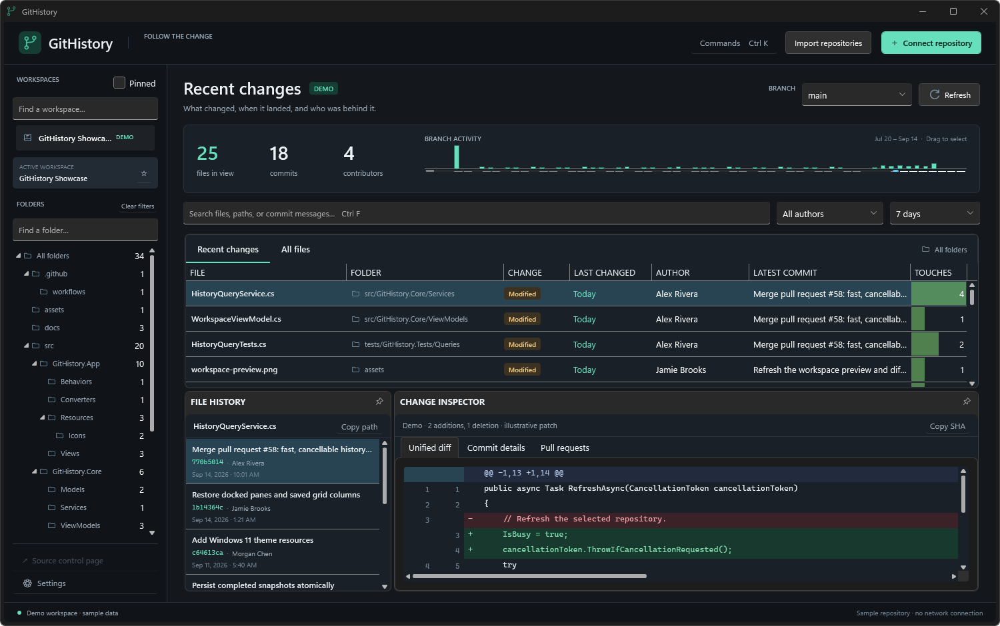
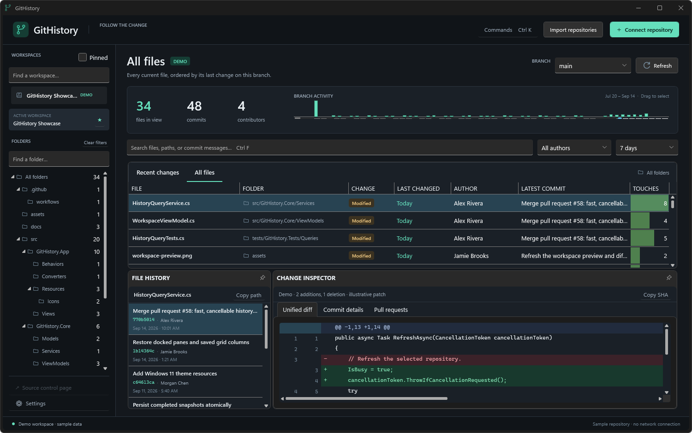
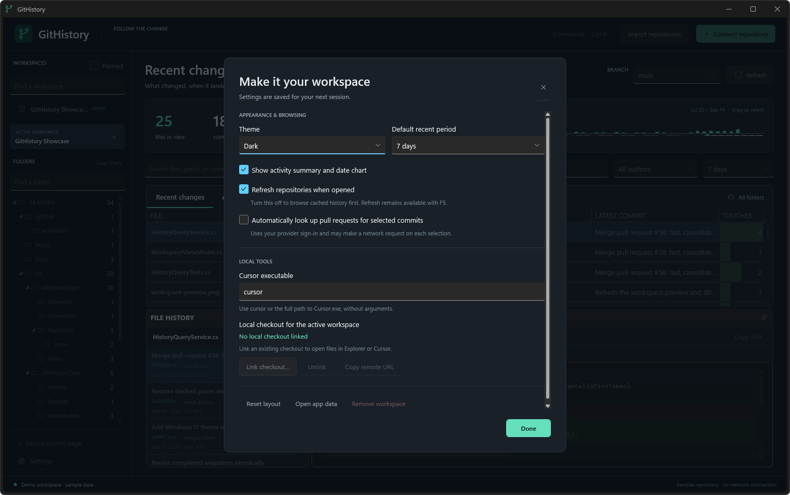
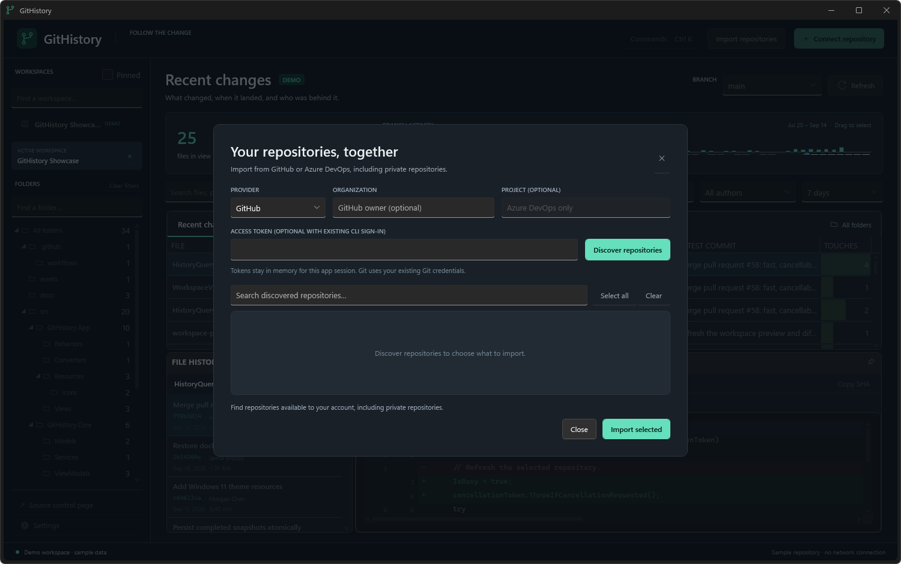
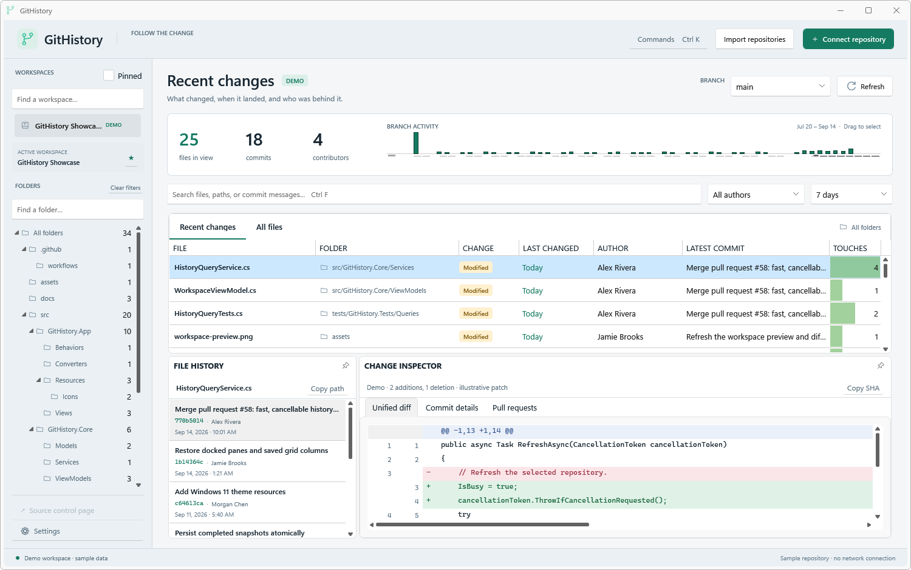
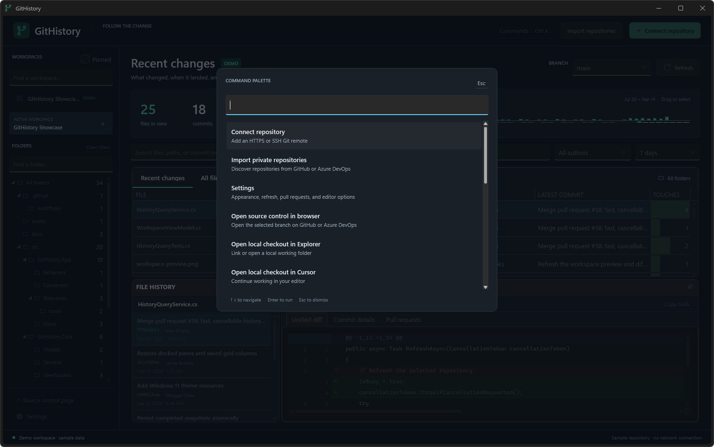

# GitHistory

**Follow the change.** A native Windows workspace for discovering which files changed in a remote Git repository—and understanding the change without leaving the app.

Built with **.NET 10**, **DevExpress WPF 26.1.4**, and **CommunityToolkit.Mvvm**. Supports HTTPS and SSH remotes from GitHub, GitLab, Azure DevOps, and other Git servers.



## Explore a repository

1. Launch the app. The clearly labeled **GitHistory Showcase** demo workspace lets you explore the interface without a network connection.
2. Choose **Connect repository** and paste an HTTPS or SSH remote URL. Git uses your existing credential helper or SSH configuration.
3. Pick a branch. GitHistory downloads its complete history into an app-owned bare cache, without checking out source files.
4. Use **Recent Changes** for a date range or **All Files** for the current tree ranked by its last branch change. Search paths, commit subjects, authors, and hashes; filter by author or folder.
5. Select a file, choose a history entry, and read its native inline diff. Copy the path or commit SHA when needed.

The activity chart and range selector narrow the date window. The file grid supports column sizing, reordering, sorting, grouping, and filtering, with a dedicated **Folder** column and full-path tooltips. Dock the history and diff panes to suit your workflow. Theme, selected repository, selected branch, view mode, pane layout, and file-grid layout survive normal shutdown; **Reset Layout** restores the defaults.



## Workspaces, private repositories, and local tools

- Search workspaces by name or remote URL. Pin favorites and switch **Pinned** on for a compact list. The active workspace remains loaded when a search hides its navigation row.
- Search the folder tree without losing the active folder filter. Matching folders retain their ancestors; **Clear filters** resets the folder, author, and file search together.
- Choose **Import repositories** to discover GitHub or Azure DevOps repositories available to your account, including private repositories. Search the results, select several, and import them together. Successful imports remain saved if another repository fails or you cancel. Importing keeps the active workspace selected.
- Use **Settings** to choose a theme and default date range, enable or disable refresh on open, hide the activity summary, control automatic PR lookups, and configure Cursor's executable. Settings, pinned workspaces, and linked checkout folders persist on normal shutdown.



GitHub discovery uses an existing `gh auth login` session; Azure DevOps discovery uses `az login` and an organization name or URL. An optional API token stays in process memory. Git connections and fetches use your existing Git Credential Manager or SSH credentials separately. See [private-repository setup and provider support](docs/providers.md).



Right-click a file or history entry for contextual actions:

| Action | Behavior |
|---|---|
| Open in Explorer | Selects the file in a linked local checkout; deleted files open the nearest existing parent folder |
| Open in Cursor | Opens the linked checkout and the selected file, when present locally |
| Copy path | Copies the exact repository-relative path |
| View file / commit in browser | Opens the corresponding GitHub or Azure DevOps revision; deleted files use the parent revision |
| Find associated pull requests | Loads provider PR titles, authors, state, and links for the selected commit |

Use **Link local checkout** to choose an existing working repository. GitHistory's bare history cache contains no working files and is not opened as a checkout. The local checkout may be on a different branch or contain edits; Explorer and Cursor open its existing contents. GitHistory does not modify or synchronize it. Repository-level actions also open the source control page, copy its remote URL, or open the linked folder.

PR references inferred from merge commit messages are labeled **unverified** until metadata is loaded. Network, indexing, filtering, diff, import, and PR operations show loading state in their affected panes; cancellation remains available. The command palette includes import, settings, pinned workspace, browser, and local-tool commands.

## Run locally

Requirements:

- Windows with the **.NET 10 SDK** for development.
- **Git for Windows** on `PATH`. HTTPS authentication uses your configured Git Credential Manager; SSH uses your installed client, agent, keys, and host trust.
- A registered **DevExpress v26.1 trial or paid developer key**. Download it from your DevExpress account and register it at `%APPDATA%\DevExpress\DevExpress_License.txt`. Never commit the key. [Official license setup](https://docs.devexpress.com/GeneralInformation/405494/trial-register/set-up-your-dev-express-license-key)

```powershell
dotnet restore GitHistory.slnx
dotnet build GitHistory.slnx
dotnet run --project src/GitHistory.App
```

All packages restore from **https://api.nuget.org/v3/index.json**. The repository's source mapping makes this explicit even when the machine has older DevExpress feed mappings.

Without a registered key, DevExpress emits its evaluation warning and may display trial notices. This repository includes neither license keys nor DevExpress binaries. Trial use is governed by DevExpress's evaluation terms; register an appropriate license before distributing an application.

### Publish for local evaluation

```powershell
dotnet publish src/GitHistory.App -c Release -r win-x64 --self-contained true -o artifacts/publish/win-x64
```

Run `artifacts/publish/win-x64/GitHistory.App.exe`. The self-contained output includes .NET; Git still needs to be installed. Published binaries remain outside Git.

## What “last changed” means

GitHistory answers **when the selected branch changed**. It walks that branch's first-parent history and compares each commit against its first parent. If a change was authored last week and merged into `main` today, the `main` row shows today's merge. Author details remain visible separately.

- Latest touch is selected by **ancestry order**, so skewed commit clocks cannot incorrectly replace a newer change with an older ancestor. Rows are then sorted by the selected touch's committer timestamp.
- Dates are stored in UTC and displayed in local time. Presets are rolling periods; custom dates include the selected end day.
- Recent Changes includes touched paths, including deletions and previous historical paths. It represents activity, not a net diff between two dates.
- In Recent Changes, each row shows its newest matching touch and counts matching touches. In All Files, search and author filters apply to each current file's latest touch.
- All Files includes only entries present at the selected branch tip. A deleted file is absent; its deletion remains visible in Recent Changes.
- Rename tracking uses Git's heuristic detection. History follows detected old paths; a deletion followed by a fresh addition starts a new lineage.
- Selecting an older filtered touch opens its complete lineage, including newer changes, with the clicked touch selected initially.
- Binary files receive a summary. Submodules show their commit pointers. Git LFS entries remain pointers; the app does not download external LFS content.
- Displayed text diffs are bounded to 2 MiB and 20,000 lines, with a visible truncation notice.
- Hover over a diff line to read and copy its full text in a scrollable tooltip, including lines wider than the grid.

Refresh runs when opening/selecting a repository or branch, or when requested manually. Disable **Refresh on open** in Settings to prefer a completed cache; a branch without a cache still fetches once. Cached results remain available if a fetch or index fails or is canceled. A refresh only replaces the completed snapshot after indexing succeeds. Force pushes rebuild the derived snapshot against the new branch tip. Previously cached branches remain selectable after remote deletion; selecting one shows the retained history and an explicit refresh failure.

## Controls and architecture



| Area | DevExpress controls |
|---|---|
| Shell and repository navigation | ThemedWindow, AccordionControl |
| File browser and folder hierarchy | GridControl / TableView, TreeListControl |
| Activity and date selection | ChartControl, RangeControl |
| Resizable details | DockLayoutManager, DXTabControl |
| Native diff | Virtualized read-only GridControl with line templates |
| Editors, progress, and appearance | DevExpress editors and loading controls; lightweight Win11Dark / Win11Light |

`GitHistory.Core` contains immutable data models, query logic, application contracts, and sealed view models. `GitHistory.Infrastructure` implements Git execution, SQLite persistence, and source-generated JSON settings. `GitHistory.App` contains XAML, presentation behaviors, desktop services, and the Generic Host composition root. `GitHistory.Tests` exercises logic and real Git fixtures without starting WPF.

View models use public partial `[ObservableProperty]` properties and generated asynchronous `[RelayCommand]` commands. Constructor injection, typed messages, and small services keep control types and side effects out of the core. Views contain no business logic or event handlers. Architecture tests and banned-API analyzers enforce these boundaries, following the relevant [ColtonStack conventions](https://github.com/coltonspears/ColtonStack).

## Keyboard shortcuts

| Shortcut | Action |
|---|---|
| Ctrl+K | Command palette |
| Ctrl+F | Focus file search |
| F5 / Ctrl+R | Refresh selected repository |
| Ctrl+D | Toggle dark/light theme |
| Escape | Close the active overlay |



## Data and diagnostics

Application data lives under `%LOCALAPPDATA%\GitHistory`: bare repository caches, SQLite history, settings, saved layouts, and local diagnostic logs. The app does not store authentication secrets or change global Git configuration. Removing a repository forgets saved metadata/history while retaining its reusable local object cache.

Git is invoked directly using structured process arguments. Paths are parsed as NUL-delimited records and remain case-sensitive, including on Windows. External diff tools and text-conversion programs are disabled. Cached snapshots are published atomically, and canceled processes are terminated with their process trees.

There is no background polling, telemetry, source editing, checkout, commit, push, or branch-comparison workflow. Local-tool actions open an existing checkout in the user's chosen application.

## Tests and screenshots

```powershell
dotnet test tests/GitHistory.Tests -c Release
dotnet run --project src/GitHistory.App -- --capture-screenshots artifacts/ui-verification
```

The opt-in screenshot command starts an isolated demo workspace and renders the **actual WPF controls**, including dark/light themes, file views, and overlays. It also records binding diagnostics and renders at 100%, 150%, and 200% density. This does not replace testing physical transitions between monitors with different scaling.

Tests cover first-parent merge attribution, clock skew, rename and delete/re-add history, unusual filenames, binary/submodule/LFS entries, force pushes, cancellation, cache recovery, query behavior, stale UI results, and architecture boundaries. See [performance measurements](docs/performance.md) for the reproducible 100,000-commit benchmark.

See the [workspace update notes](docs/navigation-update.md) for the selection fix and new features, and the [delivery verification notes](docs/validation.md) for the tested publish, screenshots, checks, and remaining manual validation.

GitHub Actions runs Windows restore, tests, and build. Set the optional `DEVEXPRESS_LICENSE` repository secret to register the build agent; never place a license in tracked configuration.

## DevExpress agent skills and MCP

Install the official WPF plugin in Codex:

```text
codex plugin marketplace add DevExpress/agent-skills
codex plugin add dx-wpf@DevExpress-agent-skills
```

The [official plugin](https://github.com/DevExpress/agent-skills/tree/main/plugins/dx-wpf) supplies the WPF skills and the `dxdocs` documentation MCP at `https://api.devexpress.com/mcp/docs`. The plugin is development tooling; it is not an app runtime dependency. CommunityToolkit remains this app's MVVM framework.
